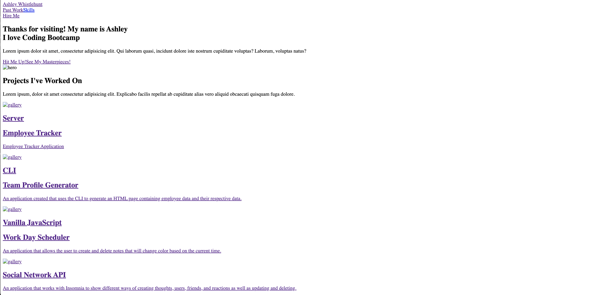

# aw-react

## Table of Contents
-[Description of Project](#description-of-project)

-[Installation](#installation)

-[Visuals](#visuals)

-[License](#license)

-[Contributing](#contributing)

-[Questions](#questions)

## Description of Project
A portfolio created entirely using REACT showing previous work, contact information, and the way REACT works

## Installation
N/A

## Visuals

## License 
N/A

## Contributing 
N/A

## Tests
N/A

## Questions 
If you have any further questions, please visit my GitHub repository at https://github.com/alandis01/aw-react. 

